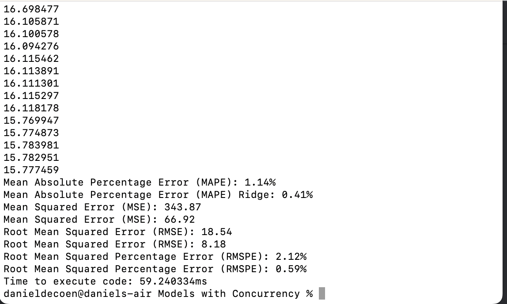
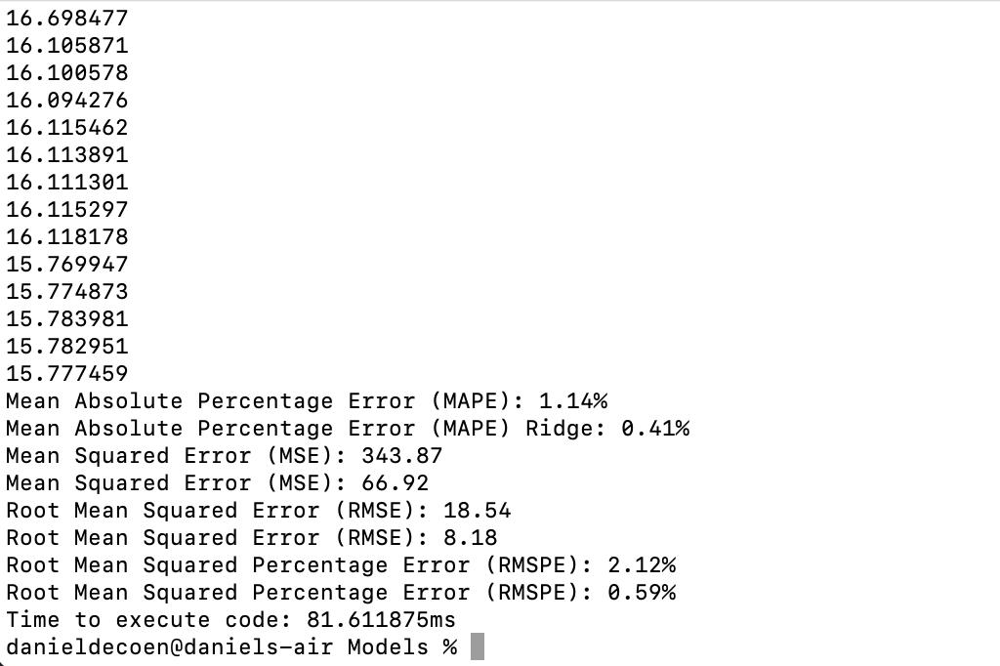

# machine_learning
Machine Learning with Go and GoRoutines

### Using Golang to predict housing prices for Boston Housing Study
1. Download Boston data in .csv format
2. Create two models to predict the median home value using Go standard library and gonum. 
    a. Run each model 100 times 
    b. Linear Regression
    c. Ridge Regression
3. Program one - No Concurrency
    a. Run Linear Regression first
    b. Run Ridge Regression after first model completes
4. Program two - Leverage Concurrency via GoRoutines 
    a. Run Linear and Ridge Regression Concurrently
    b. Compare time to run both program versions

### Results and Analysis
**Results with Concurrency**
 
**Results without Concurrency**

**Analysis**
As one can see from the results above, the models run much faster concurrently. This is a good example of when concurrency (e.g., leverage GoRoutines and/or Channels) makes sense as both models only really need to share the data once it is loaded in via the ***load_csv** function. Concurrency would not be the best path if the second model was dependent on the first model for a bunch of calculations.

***Next Steps***
It would be possible to speed up the program even more through additional use of concurrency. It would be possible to set up either channels or other GoRoutines to serve the results and/or serve the data being loaded in. I think the performance right now is pretty solid, as the nonconcurrent program clocks in around 81.61 microseconds, and the concurrent program clocks in around 59.24 mircoseconds, representing almost a 38% reducion in program run time, not bad.

